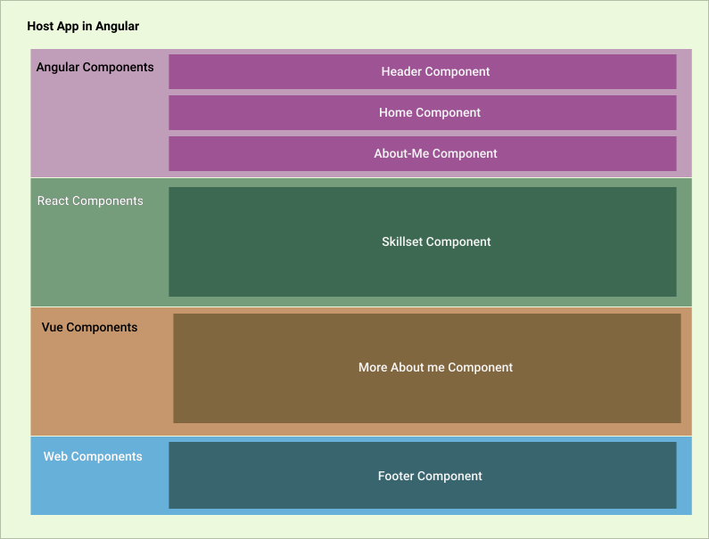

# Project - PortFolio

This project was generated using [Nx](https://nx.dev).

 

            This is web page is developed in  Angular, React, Vue  and webComponents. Host application is in Angular
            and different components are developed in different libraries.  <i>Check the below image for clear picture.</i>

 

            I used  Nx monorepo  for this mashup. The main application is in Angular and created libraries for  Angular, React and Web components.
            Since Nx is yet to add support for vue components, I created a vue component in host app it self and rendering it after converted into a web component.
            
            Host application (i.e, Angular) is passing data to other components as @Inputs() (to Angular components) or as props (to react and vue).

            Images and styles are added in Assets Library which is shared across all libraries and host application.
              
            And this application is hosted in AWS

## Folder Structure of this project

Below are our core plugins:

- apps
    - ng
        - Contains the code for host application. 
- libs
   - angular-lib
        - Contains all angular components
   - react-lib
        - Contains all react components
   - footer-lib
        - It contains web component
   - assets
        - Folder where all images and styles are present.

## Quick Start & Documentation

<h3>MonoRepos</h3>

<section>

A monorepo (mono repository) is a single repository that stores all of your code and assets for every project.

Using a monorepo is important for many reasons. It creates a single source of truth. It makes it easier to share code. It even makes it easier to refactor code.
</section>

Click here to know about [MonoRepos](https://link.medium.com/vcx4qA0cGgb)

Know how to develope monorepos using [Nx](https://nx.dev).

## Run Project

Run `nx serve ng --port 4400` to run the project and open http://localhost:4400/

ng is the name of host application which i created in Angular. Hence the name is ng.

## Build Project
Run `nx build ng` to build the project. 

A /dist folder is created at root folder and deploy this content anywhere.

## To see Dep Graph
Run `nx dep-graph` to view the dependencies of libraries

## Few More useful Commands 

<h4>Create new application in Angular</h4>

`ng generate @nrwl/angular:application <--App Name-->`

<h4>Create new application in React</h4>

`ng generate @nrwl/react:application <--App Name-->`

<h4>Creating angular library with publishable</h4>

`npx nx g @nrwl/angular:lib <--Library Name--> --publishable --importPath ng-components`

<h4>Creating react library with publishable</h4>

`npx nx g @nrwl/react:lib <--Library Name--> --publishable --importPath react-components`

<b>NOTE:</b> We can publish these libraries to npm as an artifact.

<h4>Creating Shared Assets Library</h4>

`nx g @nrwl/web:lib <--Library Name--> —directory=shared `

<b>NOTE:</b> Keep all your styles and images in this folder and this can be shared across all liraries and applications.

<h4> To remove any library </h4>

` nx g @nrwl/workspace:remove <--Library Name--> --forceRemove`
